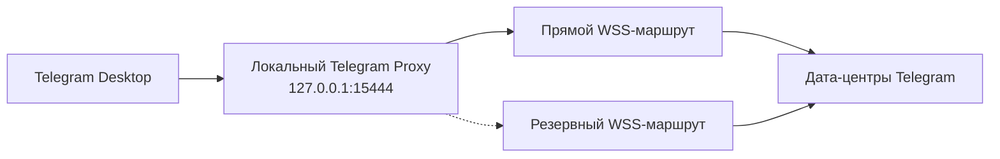

<div align="center">

# Telegram Proxy

Локальный MTProto/WSS-прокси для Telegram Desktop на Windows

[**Русский**](README.md) | [English](README.en.md)


</div>

## Обзор

Telegram Proxy создаёт локальную точку подключения `127.0.0.1:15444` и передаёт трафик Telegram Desktop через MTProto поверх защищённых WebSocket-соединений.

Приложение заранее подготавливает прямые соединения к основным дата-центрам Telegram, чтобы уменьшить время подключения и задержку. Если прямой маршрут недоступен, автоматически используется резервный WSS-маршрут.

## Архитектура



Основной трафик направляется напрямую к инфраструктуре Telegram. Резервные WSS-адреса задействуются только при невозможности установить прямое соединение.

## Быстрый запуск

1. Скачайте репозиторий через **Code → Download ZIP**.
2. Распакуйте архив в отдельную папку.
3. Запустите `telegram.bat`.
4. Подтвердите добавление прокси в Telegram Desktop.

Повторный запуск `telegram.bat` не создаёт второй процесс. Для завершения работы используйте `stop.bat`.

### Параметры подключения

| Параметр | Значение |
| --- | --- |
| Тип | MTProto |
| Сервер | `127.0.0.1` |
| Порт | `15444` |
| Secret | добавляется автоматически |

## Безопасность и шифрование

Прокси принимает подключения только с текущего компьютера и не открывает порт во внешнюю сеть. Он не запрашивает данные учётной записи, не сохраняет сообщения и не записывает содержимое соединений.

AES-обфускация является частью используемого MTProto-транспорта. Внешнее соединение защищено TLS/WSS, а шифрование данных на уровне приложения выполняет Telegram Desktop.

Диагностический журнал по умолчанию не создаётся. При необходимости остановите обычный процесс и запустите:

```bat
src\telegram-proxy.exe --port 15444 --log
```

## Устранение неполадок

| Ситуация | Решение |
| --- | --- |
| Telegram долго подключается | Запустите `stop.bat`, затем снова `telegram.bat` |
| Порт `15444` уже занят | Закройте использующее его приложение или измените порт в `telegram.bat` |
| Telegram не предложил добавить прокси | Откройте ссылку из `telegram.bat` повторно или добавьте параметры вручную |
| Требуется диагностика | Остановите прокси и запустите EXE с параметром `--log` |

Задержка и доступность зависят от провайдера, региона и текущей маршрутизации сети.

## Состав проекта

```text
telegram-proxy/
├── src/
│   ├── main.c
│   └── telegram-proxy.exe
├── LICENSE.txt
├── README.md
├── README.en.md
├── stop.bat
└── telegram.bat
```

| Файл | Назначение |
| --- | --- |
| `telegram.bat` | запуск прокси и открытие параметров Telegram Desktop |
| `stop.bat` | остановка локального процесса |
| `src/telegram-proxy.exe` | готовое приложение для Windows x64 |
| `src/main.c` | исходный код приложения |
| `LICENSE.txt` | текст лицензии MIT |

## Системные требования

- Windows 10 или Windows 11 x64;
- Telegram Desktop;
- доступ к сети.

## Лицензия

Проект распространяется по лицензии [MIT](LICENSE.txt).

Copyright (c) 2026 itzalexdev.
